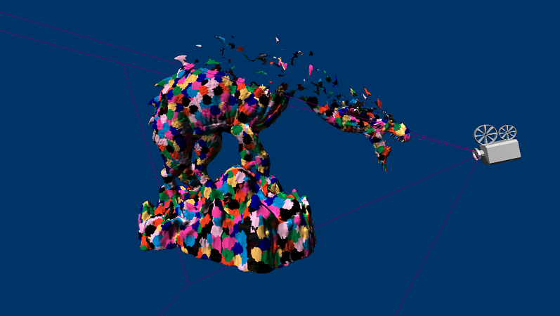
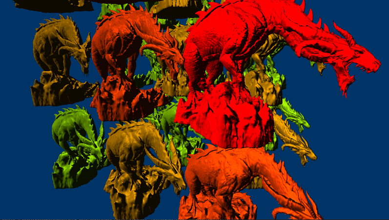

# D3D12 Mesh Shader Samples
This collection of projects act as an introduction to meshlets and rendering with DirectX Mesh Shaders. 

### Getting Started
* DirectX Mesh Shader spec/documentation is available at [DirectX Mesh Shader Specs](https://microsoft.github.io/DirectX-Specs/d3d/MeshShader.html) site.

# Projects
## 1. Meshlet Generator Library
This library provides a lightweight API for generating meshlets from streams of position and index data. The public interface can be found in D3D12MeshletGenerator.h.

## 2. Wavefront Converter Command Line Tool
This project acts as an example of how to integrate the meshlet generator library into a complete mesh conversion application. The application is structured as a basic command line tool for loading and processing obj files using the [DirectXMesh](https://github.com/microsoft/DirectXMesh) library. The processed mesh is exported using a simple binary runtime file format targeted at fast loading and rendering with DirectX apps.

## 3. Meshlet Viewer
This project demonstrates the basics of how to render a meshletized model using DirectX 12. This application loads the binary model files exported by the Wavefront Converter command line tool.

## 4. [Meshlet Instancing](src/MeshletInstancing/readme.md)
In the Mesh Shader Pipeline API there's no concept of instancing such as in the legacy pipeline. This leaves the logic of instancing meshes entirely up to application code. An inefficient implementation can waste precious threads within threadgroups. This sample demonstrates an implementation which aims to optimize instancing of meshletized meshes by packing the final, unfilled meshlets of multiple instances into a single threadgroup.

## 5. [Meshlet Culling](src/MeshletCull/readme.md)
The generic functionality of amplification shaders make them a useful tool for an innumerable number of tasks. This sample demonstrates the basics of amplification shaders by showcasing how to cull meshlests before ever dispatching a mesh shader threadgroup into the pipeline.

## 6. [Instancing Culling & Dynamic LOD Selection](src/DynamicLOD/readme.md)
This sample presents an advanced shader technique using amplification shaders to do per-instance frustum culling and level-of-detail (LOD) selection entirely on the GPU for an arbitrary number of mesh instances.

## Requirements
* [Visual Studio 2019](https://www.visualstudio.com/).
* [Windows SDK Insider Preview](https://www.microsoft.com/en-us/software-download/windowsinsiderpreviewSDK).
  * Windows 10 Insider Preview
  * Windows SDK 19041
  * DirectX 12 GPU with compatible drivers - [NVIDIA RTX](https://developer.nvidia.com/directx)

## Further resources
* [DirectX Mesh Shader Spec](https://microsoft.github.io/DirectX-Specs/d3d/MeshShader.html)
* [NVIDIA Mesh Shader Blog](https://devblogs.nvidia.com/introduction-turing-mesh-shaders/)

## Feedback and Questions
We welcome all feedback, questions and discussions about the mesh shader pipeline on our [discord server](http://discord.gg/directx).
